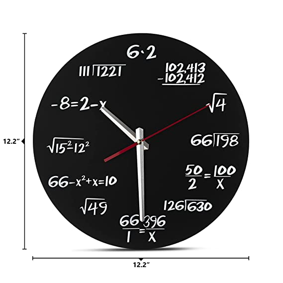
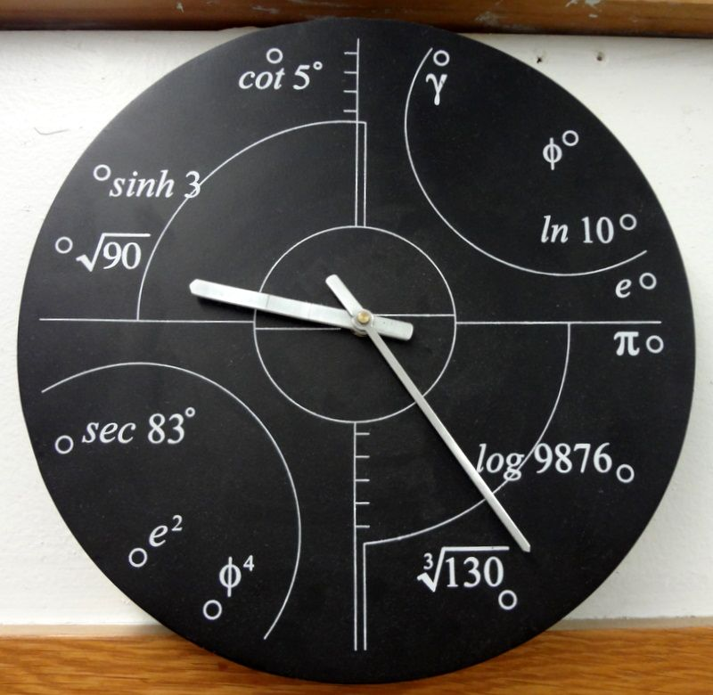
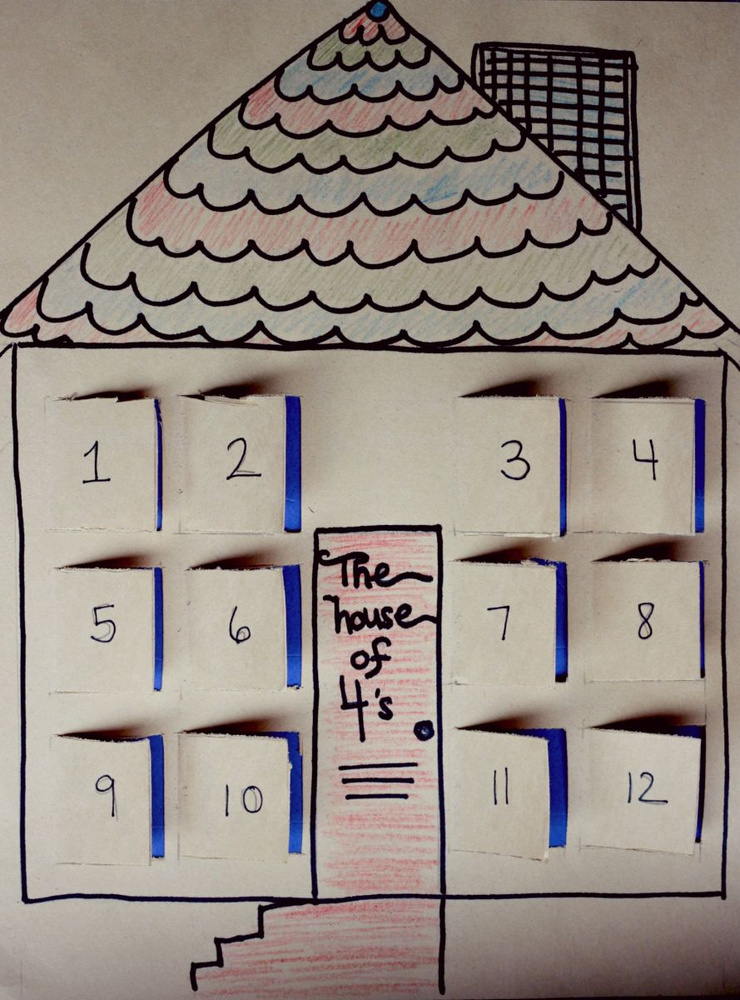
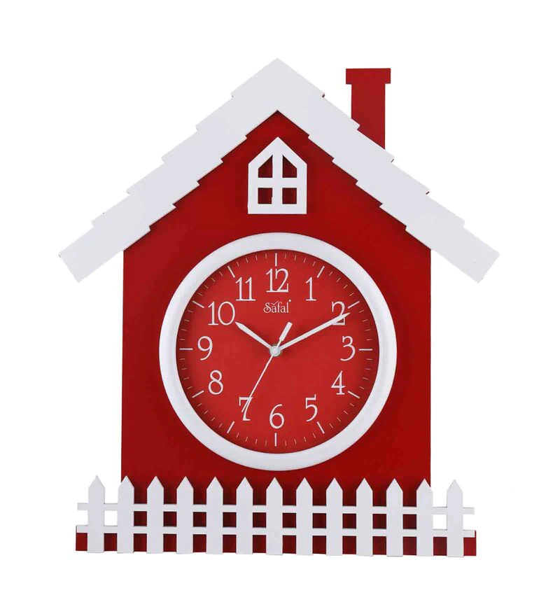
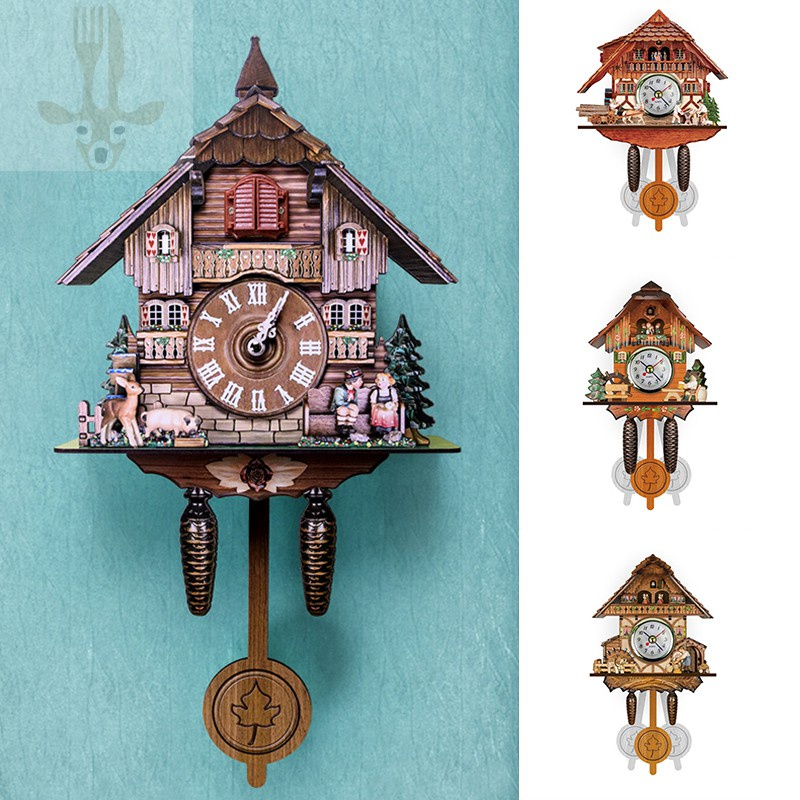
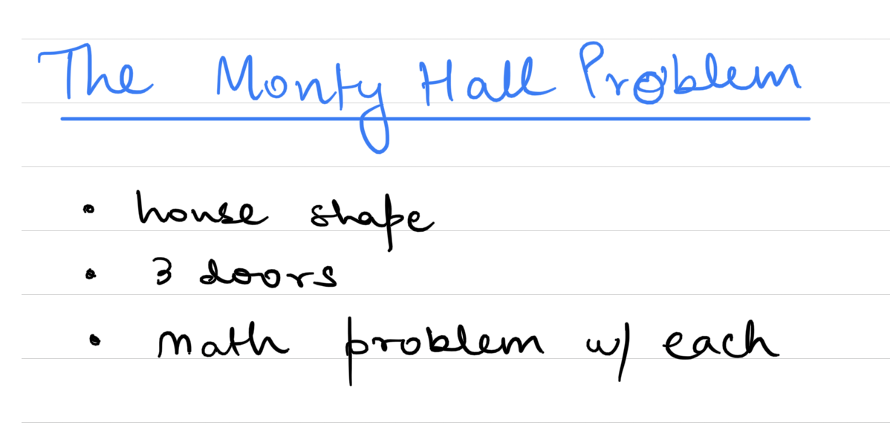
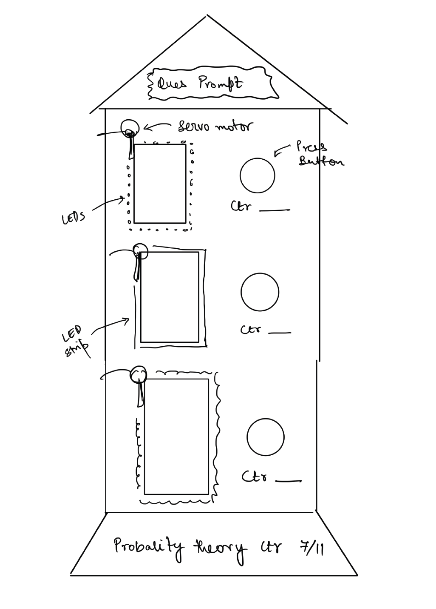
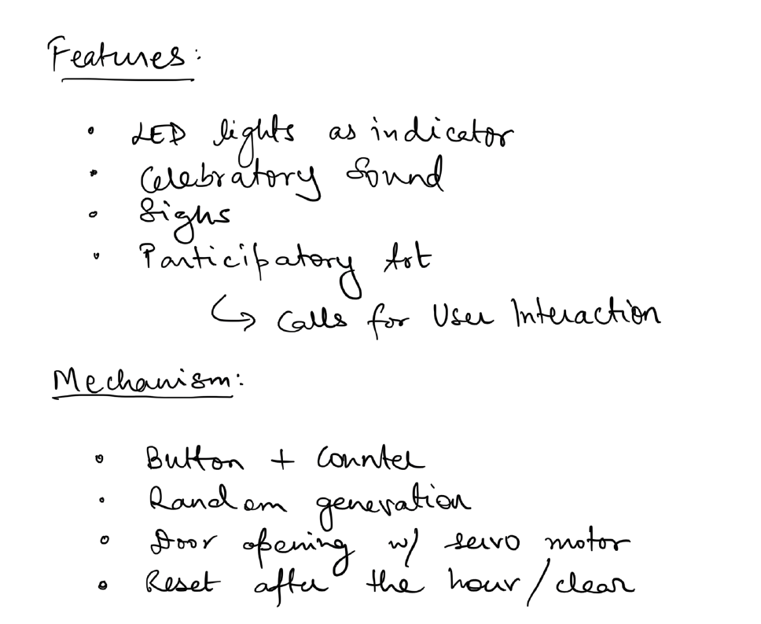

# Rough First Draft for Clock Mechanism
<h2> A MATHEMTICAL CLOCK </h2>

My life has mostly revolved around mathematics - learning, teaching, solving logical puzzels, playing math games, researching, etc. 
 So, when I got to the chance to design my own clock, of course I searched for math inspirations!
 Also, whenever Ithink of a clock, I am remnded of houses - maybe because of the cuckoo clock I had in my home as a kid which had a house structure at the top. Furthermore, there are many house clocks I have seen growing up and my childhoos was spent with doll houses, I wanted to incorporate this theme in my clock as well. Here are some inspirations photos I looked at:

<h3>Inspiration Photos</h3>

Some math clocks

<!--  -->

Some house structures

<!--  -->

<h3>The Monty Hall Problem</h3>

While searching, then it finally hit!! The Montly Hall math problem combines both these ideas of mine - math and a house!
 Below is an exaplantion video of what the Montly Hall problem is:

https://www.youtube.com/watch?v=mhlc7peGlGg

And this is how it inspired my clock mechanism idea and how I incorporated it:
 

<h4>The mechanism:</h4>

<ul>
	<li>There are 3 doors on the house. Besides each door there is a button to vote. It also displays a counter for the vote count.
	<li>For the first 15 mins, the audience gets to vote and pick a door to open. The door that gets the highest vote is chosen as the audience's choice.
	<li>Then program chooses to open one of the doors that isn't the audience's choice and reveals a donkey.
	<li>Then for the next 15 mins, the audience is given a choice to whether change their choice of the picked door or not with a yes/no button. The same voting idea is used.
	<li>The chosen doors are indicated by lighting the LED around the door. The door revealing the donkey stays opened.
	<li>At the final 1 hr mark, the prize i.e. the car is finally revealed. Does the probability theory hold? We an keep a counter for that too!
	<li>A celebratory clapping sound is played if the probabilty theory holds, or a sigh is heard if not.
</ul>

** Note: The donkey and prize car can be replaced with other things which go with the overall concept/theme or mybe math problems ;)

<!--   -->

<!-- 
 -->

<!--  -->
<!-- 
 -->

<!--   -->

<h4>Some problems:</h4>

<ul>
	<li>Not having any vote for the time period --> would need a tie breaking mechanism.
	<li>Will the LEDs run for the whole year?
</ul>

