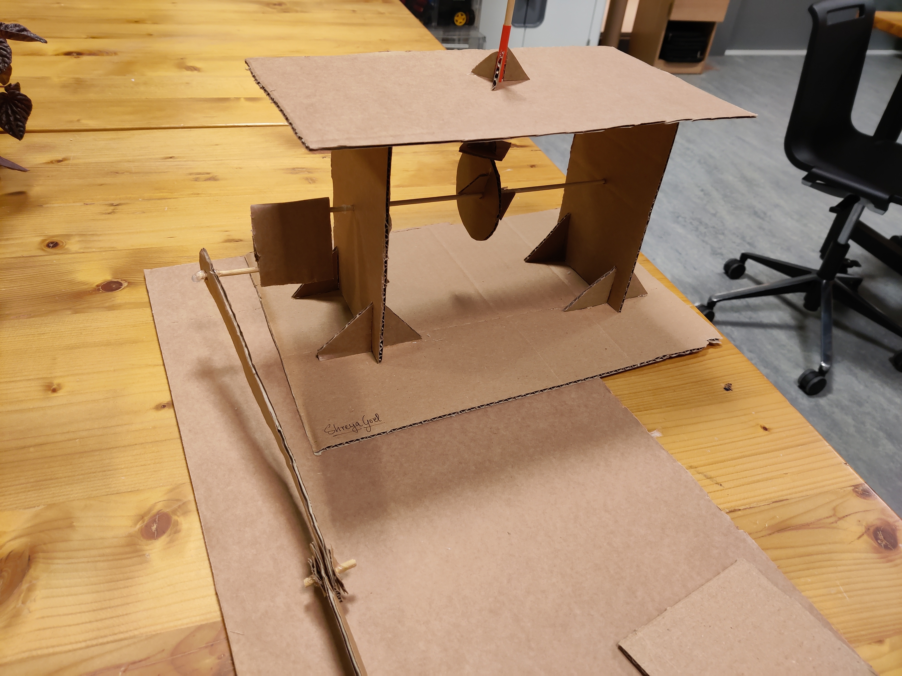
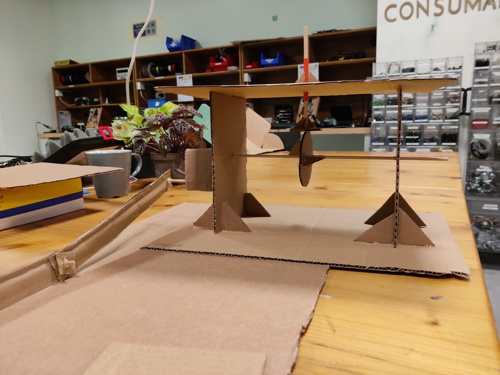
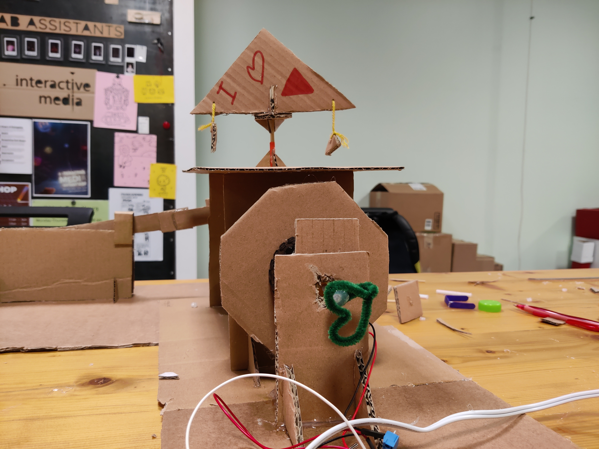
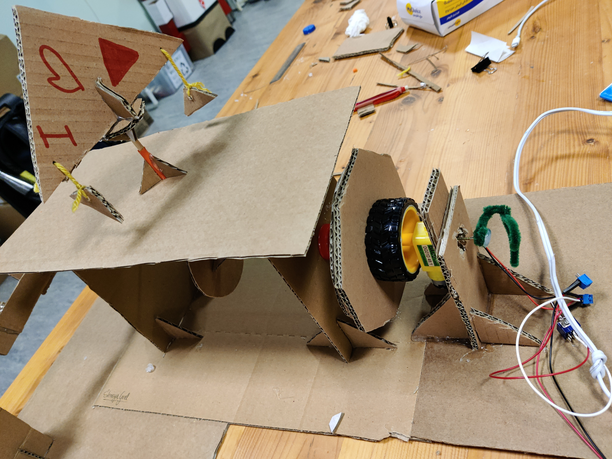
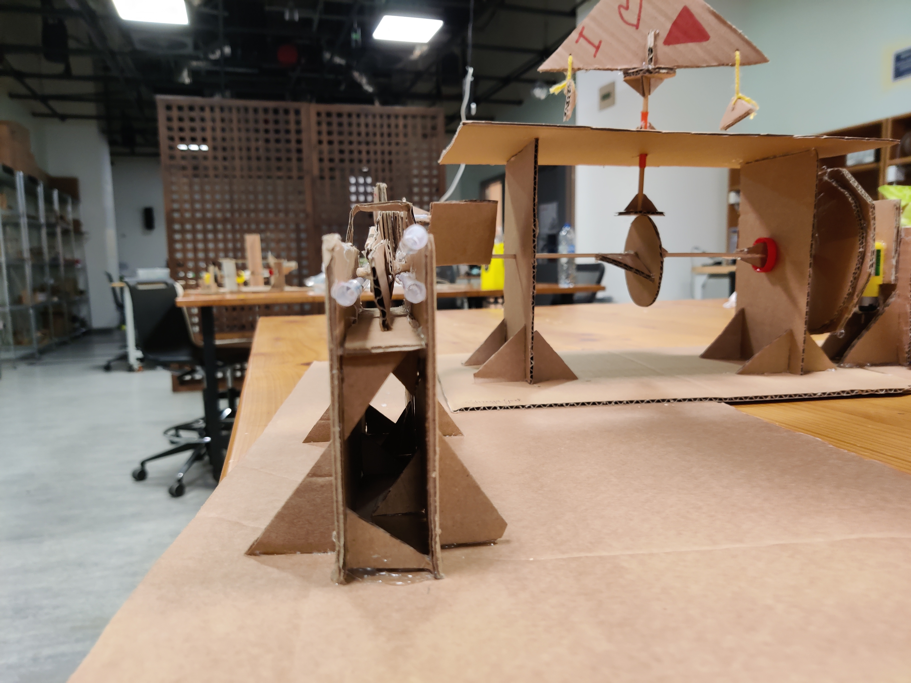
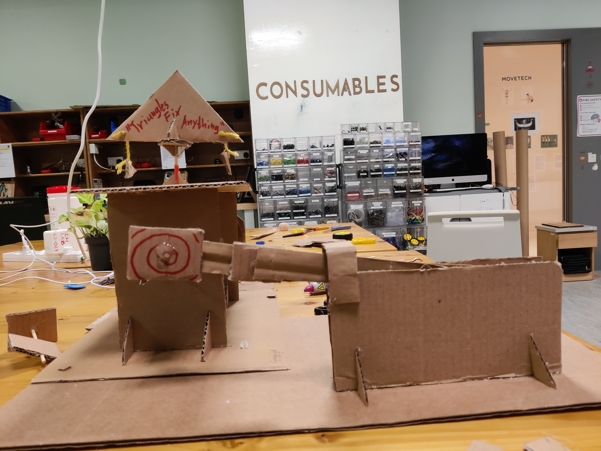

# MachineLab

For my Interactive Media Machine lab Class, in the past 2 weeks, we have built crank mechanism with a cam, crank and slider attached to a motor (a cardboard automata). The basic structure is built using cardboard while other recyclable materials like bottle caps, starws, sticks, etc. have also been used.

<h2>My Experience</h2>

I had a lot of fun working on this project. I have never realy worked with mechanics before and I thoroughly enjoyed cutting, measuring, glueing and making something that actually works after it actually collapsed. It was not as easy at it seemed but running into issues and then learning how to fix them was both fascinating and encouraging.

<h2>Technical Problems</h2>

I ran into many problems some of which are:
  <ol>
    <li>Building the basic structure with the crank was somewhat easy. I did not run into many problems here but just one that the stick for the crank was too short and the straw was longer than it should've so it stuck and the crank was not able to move up and down. I changed the stick and cut short the straw accordingly.
    <li>The most disasterous was when I connected the motor. Almost the entire structure fell apart. The glue was not enough and I believe there was not enough surface area in contact to keep the parts attached and strong enough to sustain the force put by the motor. many of the triangles came off and pther parts flew away as a result. I made bigger triangles then and put a lot more glue to hold the structure in place this time.
    <li>A faced a lot of problems with the slider mechanism as well. There were many iterations of it I had to make, improving one aspect of it each time. 
      <ol>
        <li>Initially, the slider worked well on the floor. But when I had to raise it to a platform, I ran into problems. After experimenting on how to make it work, I realized that the part joining the extra handle and the slider has to be on the platform as well for smooth movement. Thus I extended the table accordingly. 
        <li>After extending the table, I needed walls, which I put.
        <li>However, it still was not stable. One reason I speculated was that the extra handle was supported in place on the cam stick with just 2 glue gun dots on either side. It needed a more rigid support. So, I remived the glue gun dots and made a square cardboard piece. However, in doing so, the alignment got a bit off. The extra handle was pushed farther in than before which made the handle and slider at an angle instead of being absolutely staright. Due to this, when I turned on the motor, the model broke a second time. 
        <li>The idea was to displace the handle back to its position. So, I cut it from the middle and placed a cardboard piece in between. This adjusted the diaginally aligned handle into a straight L-shaped mechanism. This worked, but...
        <li>The cardboard handle was too fragile now and bent away and the slider came out of the platform. To make the handle rigid, I supported it with a stick which held it in place and did not allow it to move.
        <li>The slider still jumped a lot. So for that, I did 2 things. Firstly, I put the a litte cardbboard pice like a  gate banner or roof sort of to not have the slider fly away. And then, to further restrict the slider movement to a linear motion, I put straws on the walls of the table so that the slider has a groove now to move in a huided manner. 
      </ol>
  </ol>

<h2>The Process Gallery</h2>

Here are some photos and videos of 'The Making':

<video src="1.mp4">

<h2>The Final Video</h2>

Here is a one minute working video of my cardboard automata:

