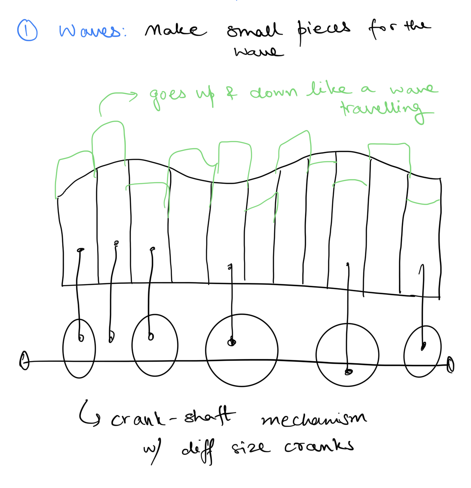
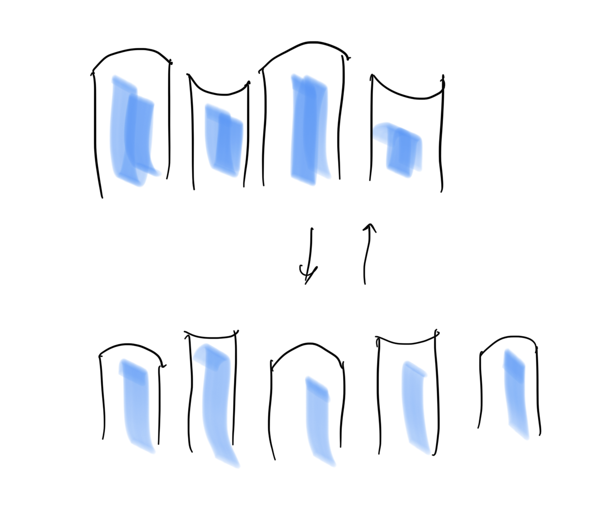
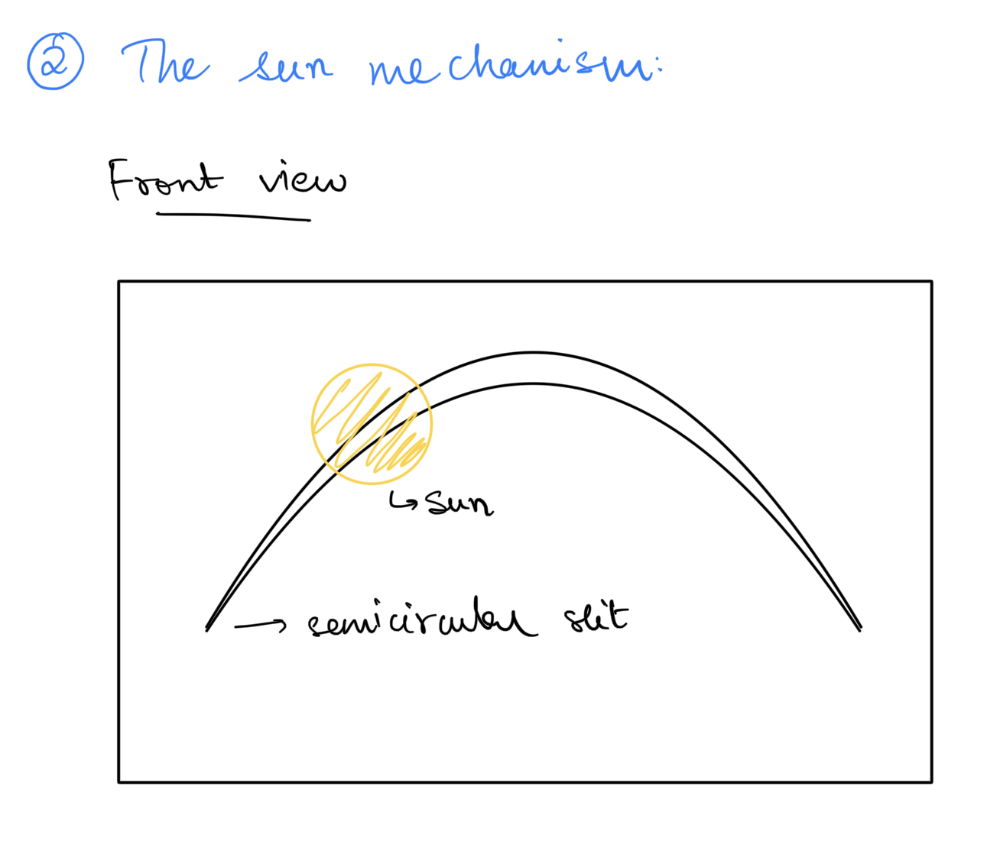
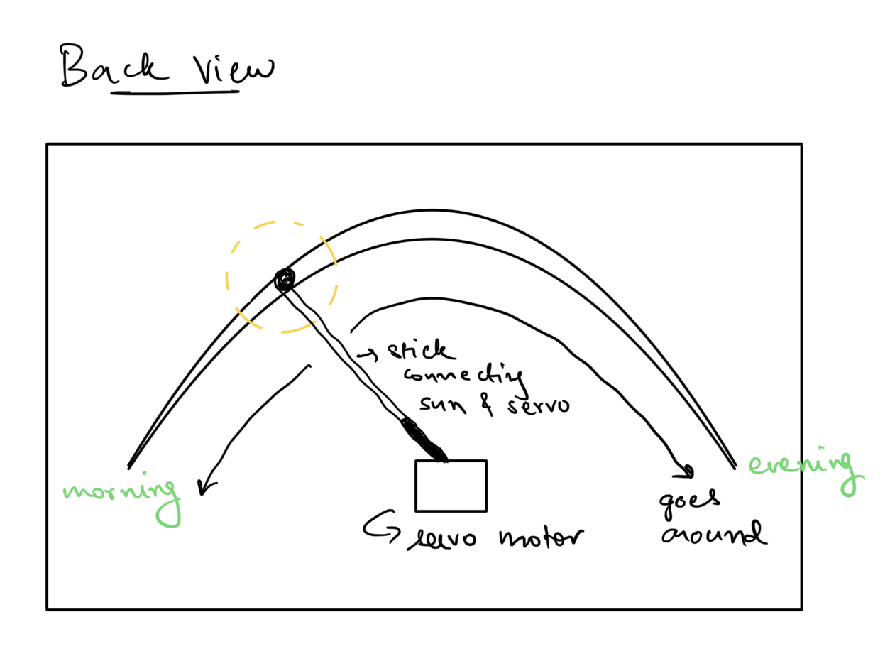

# UAE + Time based theme project idea

For this project, Amina and I want to team up together. We have come up with an idea for the same: 
https://github.com/ak7588/machineLab/tree/main/6March

Some additions and further explanations are are follows:

<ol>
	<li>Instead of being one full piece, the waves will be a series of small pieces which can individually go up and down to create a wave effect. We will achieve this mechanism by having each wave parts connected to a crank of different size/shape and multiple cranks connected to one shaft. Due to this, when the shaft is rotated, each linear motion will be a bit different (some longer, some shorter) due to different crank sizes which will make the waves go up and down for the desired effect. We do assume this to be the ahrdest part and this is what we will be working on / prototyping first because we actually need to try and see of this mechanism is feasible and if it does actually look like a wave flowing. Because if it doesn't, then we will have to change our mechanism to implement it, so better we try it early on!
		
		
	<li>We will have the sun go from one side to another in a semi-circular fashion to create the effect of the day passing by. We will achieve this by makinf a semicircluar slit in a sky painted wall. Attach the sun in front of the wall to a stick behind the wall which inturn is connected to a servo motor which will go 180 degress for the desired motion.
		
		
</ol>