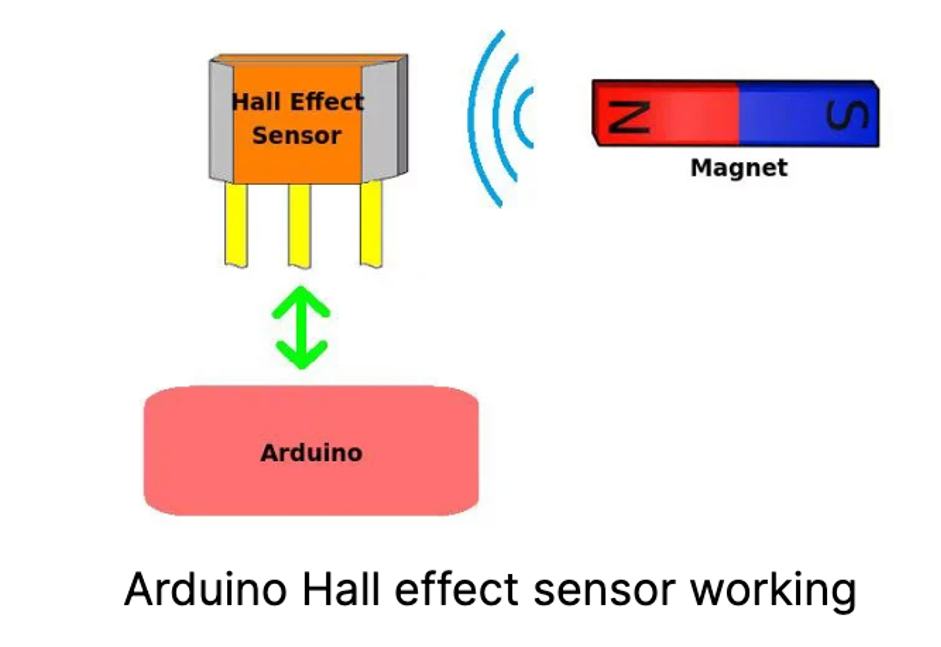
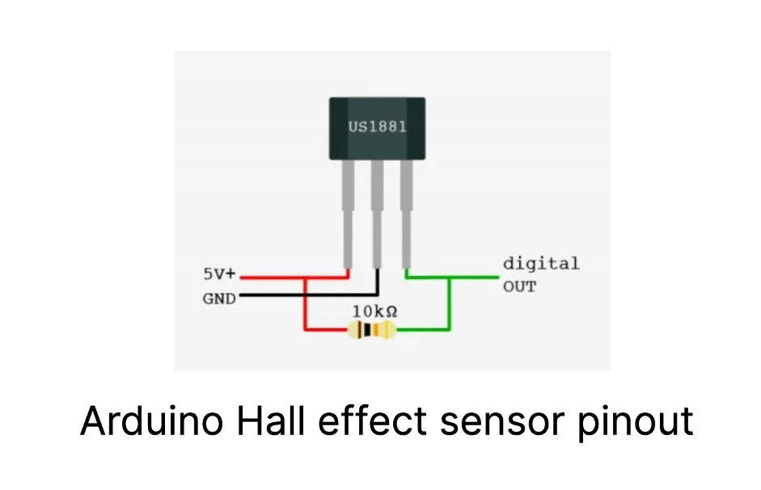
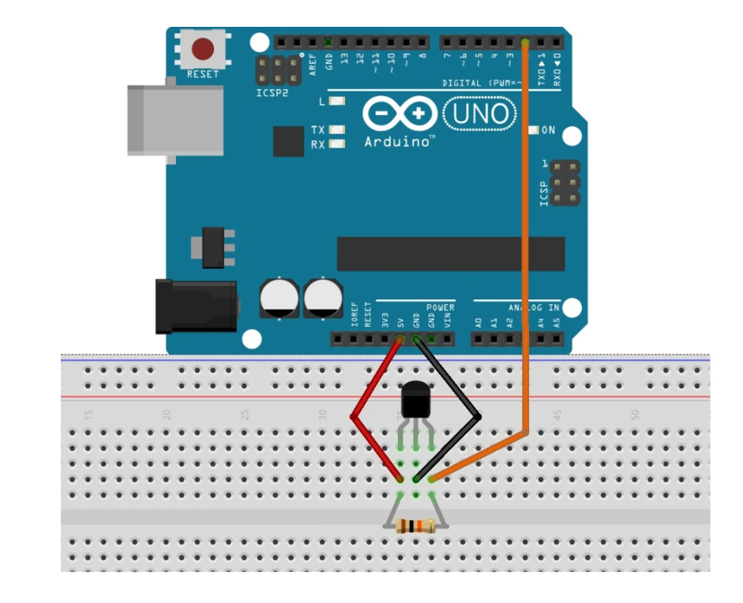
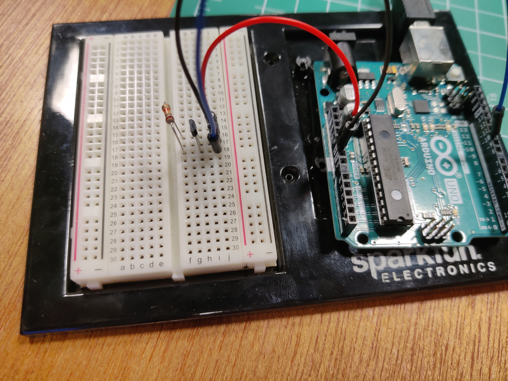
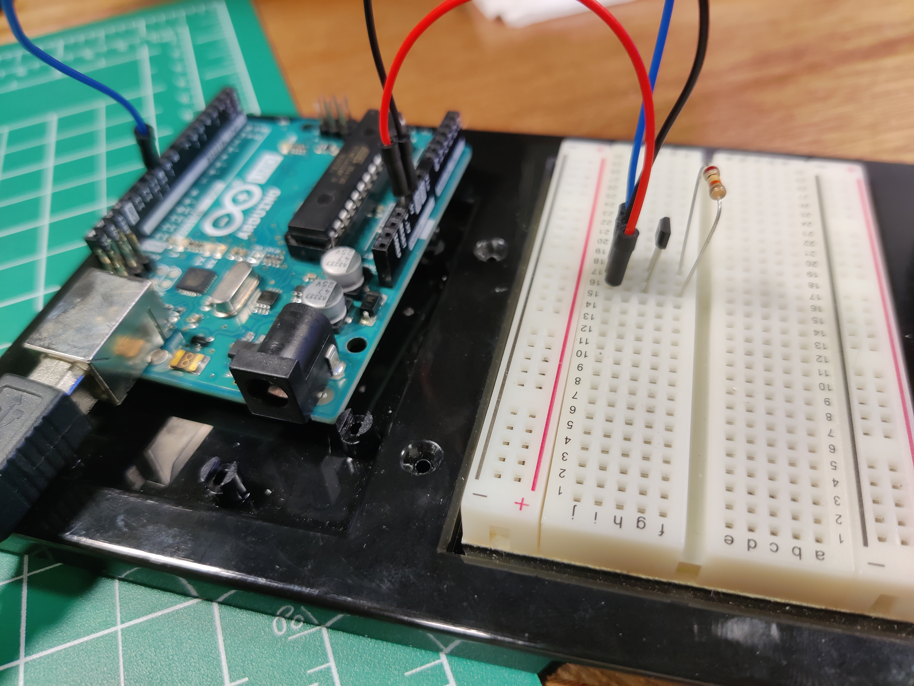
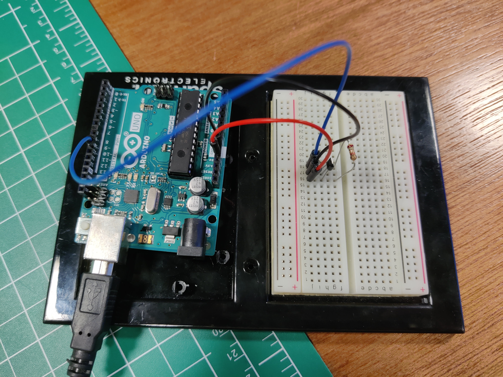
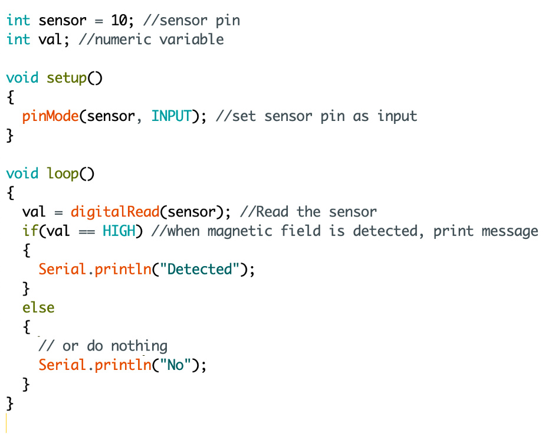

# The Hall Effect Sensor

<h3>What is it?</h3>

<h3>How does it work?</h3>

<h3>My Circuit</h3>

<h3>Problems</h3>

The problems I ran into were figuring out which pins were the Vin, the analogue pin, and the ground pin. 
It was very clear in the documentation on how to wire up the sensor and different sites gave different solutions (two of which I mainly reffered to are linked below).
In trying to figure out how to make it work, I played around with the wire combinations and the resistor values and sadly ended up burning the hall effect sensor :(

Even though I was unable to make the circuit work, this was a valuable experience.

<h3>The Code</h3>

<h3>Resources</h3>
Links to resources I used:
<ol>
  <li>https://littlebirdelectronics.com.au/guides/67/hall-effect-sensor-with-arduino (has the wrong diagram)
  <li>https://maker.pro/arduino/tutorial/how-to-use-a-hall-effect-sensor-with-arduino
  <li>https://www.adafruit.com/product/158
  <li>https://www.adafruit.com/datasheets/US5881_rev007.pdf (the data sheet)
</ol>
 
<h3>Presentation</h3>
The presentation I prepared for class can be found here:
