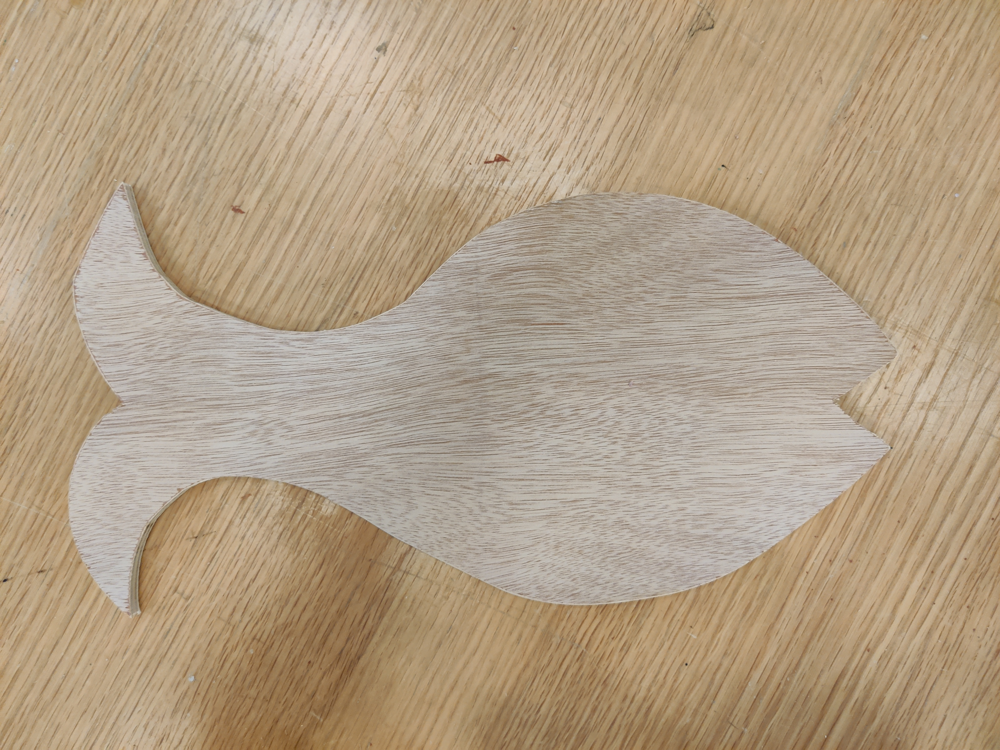
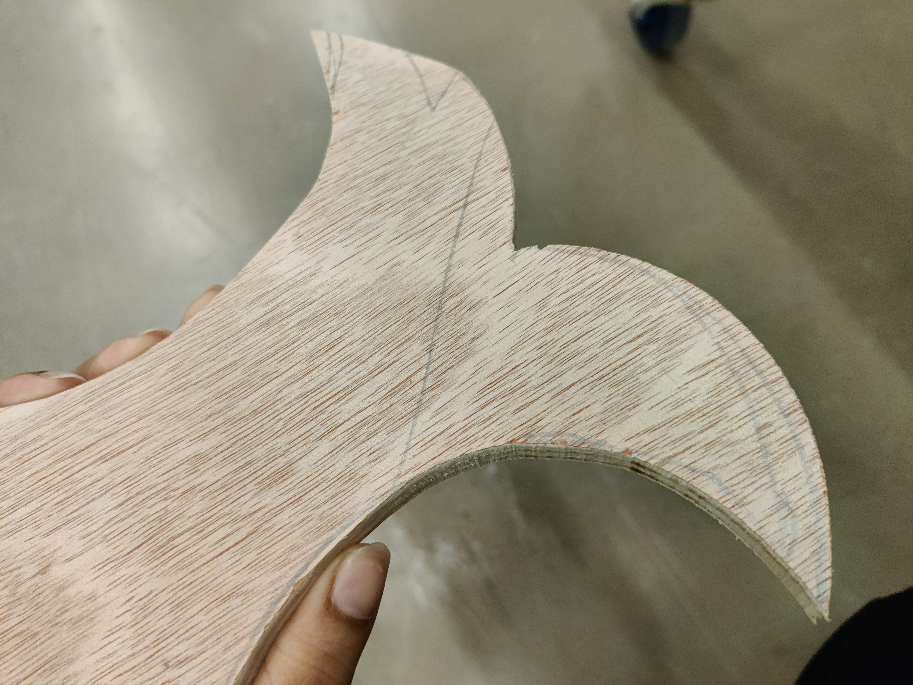
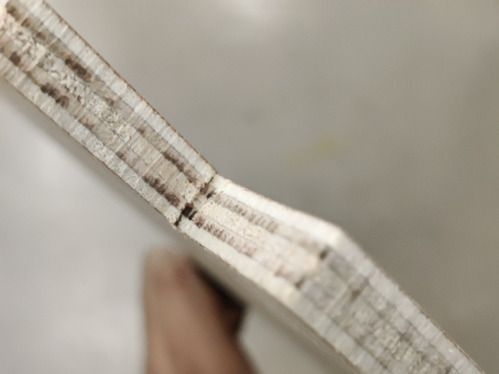
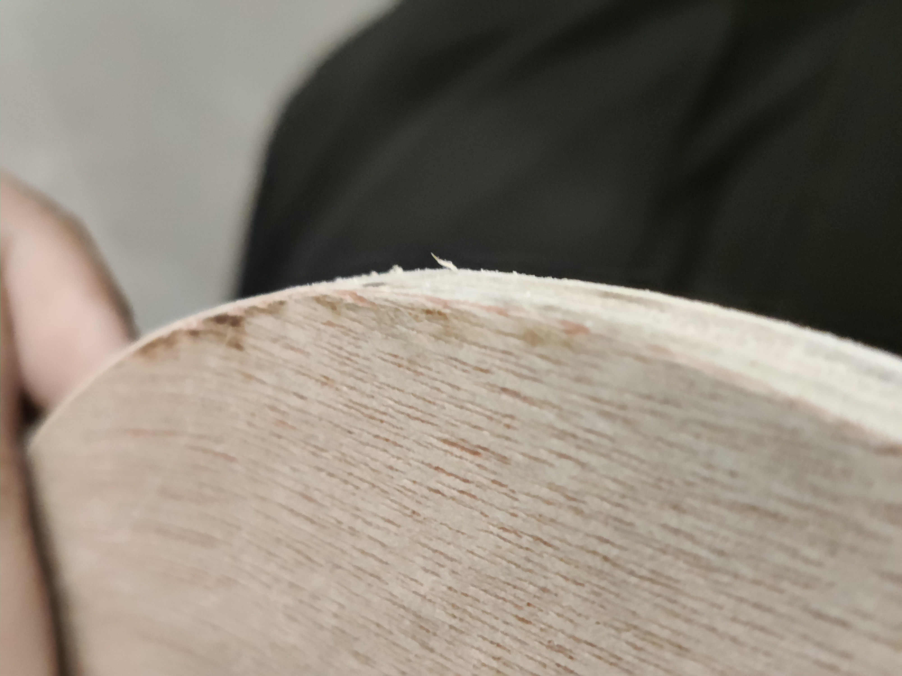

# The Wood Worskshop

<h4>
	13 February 2023
</h4>

	Today we had the opportunity to vist the Scene Shop and attend the Wood Worshop, learning about the many different 
	<ul>
		<li>cutting, 
		<li>shaping,
		<li>and sanding 
	</ul>
	of wood techniques.

	This is what I made after a 3 hour workshop: My Little Fishy!

Here are some photos of 'The Making'.

	
	
	

